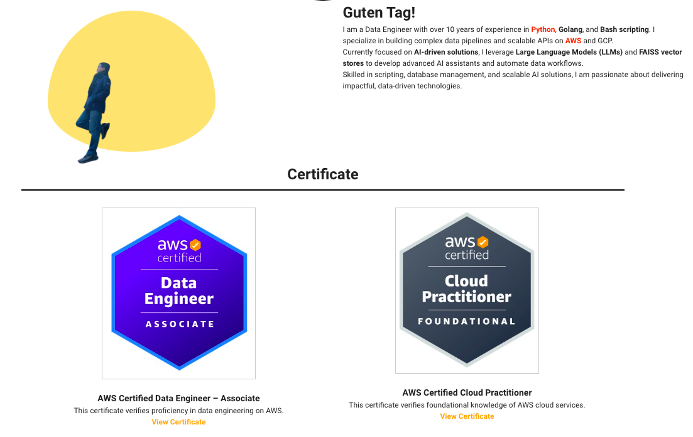

# ja_portfolio_vue_app
As fron-end to show case by using threejs and aws-infra to build ai-game (llm)


## Feature: Link Sub-Domain IFrame

### Updates
- Added iframe between **Certificate** and **Skills** components.
  - Adjusted iframe margins for better visual alignment: **15% left**, **10% right**.
  - Displayed a fallback message in golden color when iframe load fails.
- Implemented logic to hide the iframe when accessed from a mobile or tablet device.
  - Added a method to detect user agent and determine if the client is on mobile.


---
# my-new-vue-project




------

## Project setup
```
npm install
```

### Compiles and hot-reloads for development
```
npm run serve
```

### Compiles and minifies for production
```
npm run build
```

### Lints and fixes files
```
npm run lint
```

### Customize configuration
See [Configuration Reference](https://cli.vuejs.org/config/).
